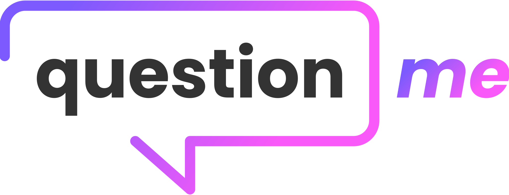
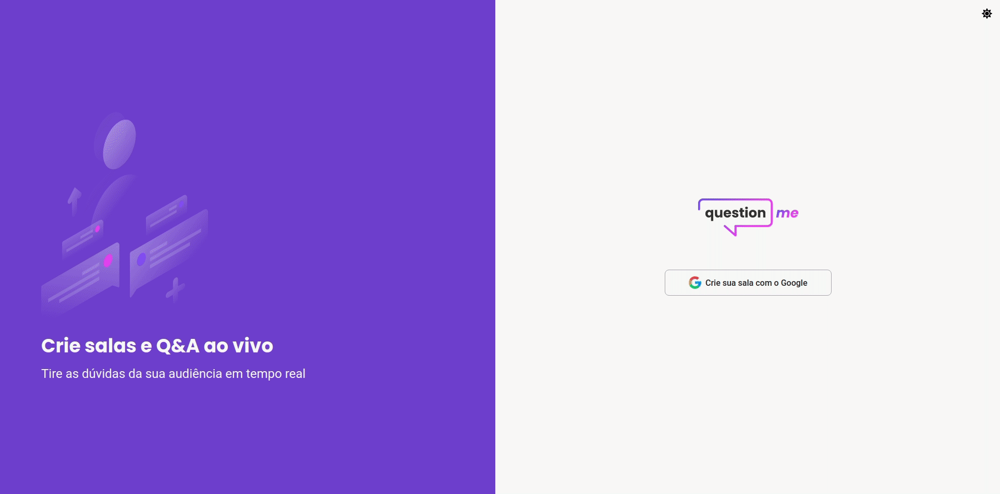
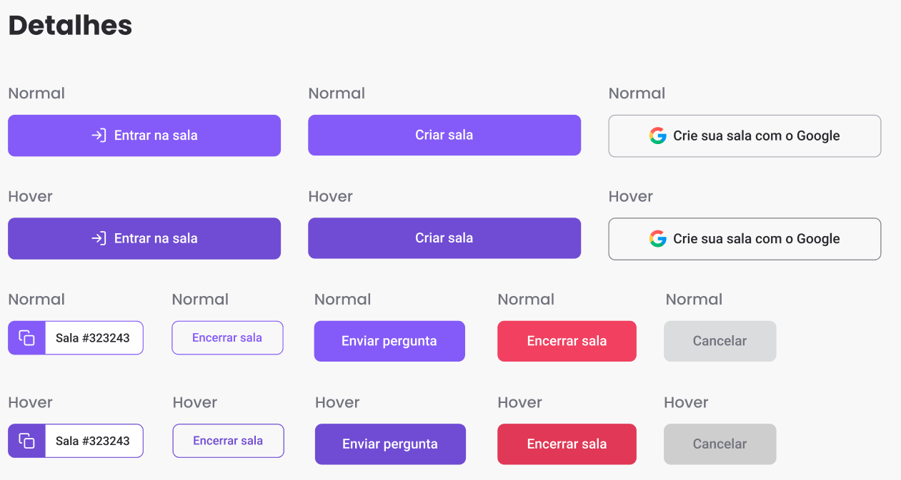

<br/>
<p align="center">
  
</p>

<br/>

<p align="center">
  
  
  
   <br />
</p>

<p align="center">
  <a href="#-projeto">Projeto</a>&nbsp;&nbsp;&nbsp;|&nbsp;&nbsp;&nbsp;
  <a href="#-tecnologias">Tecnologias</a>&nbsp;&nbsp;&nbsp;|&nbsp;&nbsp;&nbsp;
  <a href="#-material-de-apoio">Material de apoio</a>&nbsp;&nbsp;&nbsp;|&nbsp;&nbsp;&nbsp;
  <a href="#-apresentação-visual">Apresentação visual</a>&nbsp;&nbsp;&nbsp;|&nbsp;&nbsp;&nbsp;
  <a href="#-como-baixar">Como baixar</a>&nbsp;&nbsp;&nbsp;|&nbsp;&nbsp;&nbsp;
  <a href="#-sobre"> Sobre </a>&nbsp;&nbsp;&nbsp;|&nbsp;&nbsp;&nbsp;
  <a href="#-backlog">Backlog</a>

---

## 💬 Projeto

<p align="justify">
  Já pensou que em lives as pessoas recebem muitas perguntas, principalmente quando se ensina alguma coisa, ou apresenta algum produto/serviço? - Pois é, são várias perguntas e os apresentadores das lives tem que responder as perguntas, afinal, são clientes/possívels clientes não é mesmo?

  Sabendo dessa necessidade, a Rocketseat teve a brilhante ideia de elaborar um projeto que consiste no ranqueamento de perguntas para que as perguntas prioritárias dos aprensetadores das lives sejão as mais ranqueadas ou seja, as dúvidas que são mais frequentes pela comunidade.

  <p align="center">
    
  </p>

</p>

---

## 📌 Tecnologias

<p align="justify">
  Abaixo estão algumas das tecnologias utilizadas durante o desenvolvimento do projeto. Ainda foi visado: Organizar o diretório da nossa aplicação de forma concisa, limpa e eficiente. Escrever código limpo visando reutilização e eficiência.
</p>

<br>
<p align="center">
  
  
  
  
  
  
  
  
  
  

</p>

---

## 🗂 Material de apoio

- [Typescript](https://www.typescriptlang.org/)
- [Firebase Security Rules](https://firebase.google.com/docs/reference/security/database)
- [Create React App](https://github.com/facebook/create-react-app)
- [Sass](https://sass-lang.com/)
- [ReactJS](https://pt-br.reactjs.org/)

---

## 📊 Layout:
O layout foi baseado no protótipo idealizado no [Figma](https://www.figma.com/file/NCde0NX0EBH0NgVhrc2rvI/Letmeask-(Agora-vai)?node-id=0%3A1) e conforme imagem abaixo:
<p align="center">
  
</p>

---

## ⬇️ Como baixar

```bash
  // Clonar repositório
  $ git clone https://github.com/douglasconstancio/letmeask.git

  // Acessar diretório
  $ cd letmeask

  // Instalar dependências
  $ yarn

  // Iniciar build
  $ yarn build

  // Iniciar projeto
  $ yarn start
```
---

## 💭 Backlog

- 🟢 Torná-lo responsivo
- 🟢 Melhorias visuais e de estado de alguns botões
- ⛔️ PWA (Rodar off) - Utilizar e estudar o Next PWA
- 🟢 Dark Theme
- ⛔️ Testar outros bancos de dados ex: _(Firestore, Supabase, FaunaDB)_
- 🟢 Ao criar sala redirecionar para admin e não para usuario padrão
- 🟢 Usar modal ex: (react-modal)
- ⛔️ Melhorar o carregamento das perguntas
- 🟢 Validar se a sala já não foi encerrada quando enviar pergunta
- 🟢 Dono da sala conseguir ver quantidade de likes
- ⛔️ Dono da sala conseguir ver quantidade de pessoas ativas (talvez as fotinhos...) ⭐
- 🟢 Opção de adicionar perguntas anônimas
- ⛔️ Usuário saber quais salas abertas ele possui ⭐
- ⛔️ Separar instâncias do ambiente de **dev** e de **prod**
- 🟢 Adicionar hint/tooltip em alguns botões e campos
- ⛔️ Adicionar opção para administrador setar término dos envios de perguntas;
- ⛔️ Configurar Prettier/ESlint para o projeto;
- ⛔️ Adicionar testes E2E (`cypress`, `cucumber`...);
- ⛔️ Adicionar opção do usuário remover pergunta (quando não estiver em destaque ou respondida);
- ⛔️ Perguntar se realmente quer sair da sala antes de redirecionar ao clicar no link do _Header_
- ⛔️ Adicionar licença ao repositório

---

## 🚀 Sobre

Esta disponibilizada nesta [URL](https://letmeask-c792d.web.app/) a primeira versão do projeto.

<p align="justify">
  Este projeto foi idealizado na trilha de ReactJS na edição Together do NLW da Rocketseat. O NLW é um evento online com muito código, desafios, networking e aprendizado.
</p>

---
