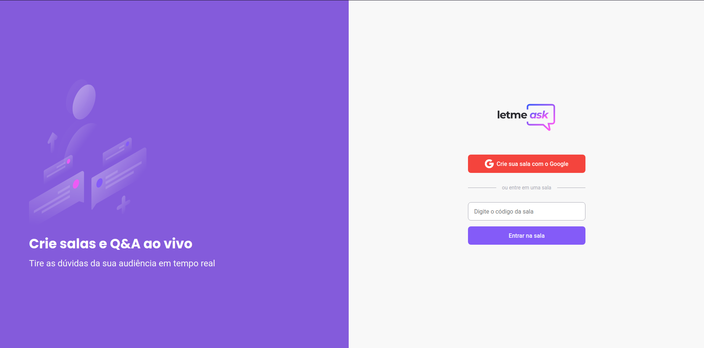

<br/>
<p align="center">
  
</p>

<br/>

<p align="center">
  
  
  
   <br />
</p>

<p align="center">
  <a href="#-projeto">Projeto</a>&nbsp;&nbsp;&nbsp;|&nbsp;&nbsp;&nbsp;
  <a href="#-tecnologias">Tecnologias</a>&nbsp;&nbsp;&nbsp;|&nbsp;&nbsp;&nbsp;
  <a href="#-material-de-apoio">Material de apoio</a>&nbsp;&nbsp;&nbsp;|&nbsp;&nbsp;&nbsp;
  <a href="#-apresentação-visual">Apresentação visual</a>&nbsp;&nbsp;&nbsp;|&nbsp;&nbsp;&nbsp;
  <a href="#-como-baixar">Como baixar</a>&nbsp;&nbsp;&nbsp;|&nbsp;&nbsp;&nbsp;
  <a href="#-sobre"> Sobre </a>&nbsp;&nbsp;&nbsp;|&nbsp;&nbsp;&nbsp;
  <a href="#-melhorias">Melhorias</a>

---

## 💬 Projeto

<p align="justify">
  Já pensou que em lives as pessoas recebem muitas perguntas, principalmente quando se ensina alguma coisa, ou apresenta algum produto/serviço? - Pois é, são várias perguntas e os apresentadores das lives tem que responder as perguntas, afinal, são clientes/possívels clientes não é mesmo?

  Sabendo dessa necessidade, a Rocketseat teve a brilhante ideia de elaborar um projeto que consiste no ranqueamento de perguntas para que as perguntas prioritárias dos aprensetadores das lives sejão as mais ranqueadas ou seja, as dúvidas que são mais frequentes pela comunidade.

  <p align="center">
    
  </p>

</p>

---

## 📌 Tecnologias

<p align="justify">
Abaixo estão algumas das tecnologias utilizadas durante o desenvolvimento do projeto. Ainda foi visado: Organizar o diretório da nossa aplicação de forma concisa, limpa e eficiente. Escrever código limpo visando reutilização e eficiência.
</p>
<br>
<p align="center">
  
  
  
  
  
  
  
  
  
  


</p>

---

## 🗂 Material de apoio

- [Typescript](https://www.typescriptlang.org/)
- [Firebase Security Rules](https://firebase.google.com/docs/reference/security/database)
- [Create React App](https://github.com/facebook/create-react-app)
- [Sass](https://sass-lang.com/)
- [ReactJS](https://pt-br.reactjs.org/)

---

## 📊 Layout:
O layout foi baseado no protótipo idealizado no [Figma](https://www.figma.com/file/NCde0NX0EBH0NgVhrc2rvI/Letmeask-(Copy)?node-id=45%3A3279) e conforme imagem abaixo:
<p align="center">
  
</p>

---

## ⬇️ Como baixar

```bash
    // Clonar repositório
    $ git clone https://github.com/douglasconstancio/letmeask.git

    // Acessar diretório
    $ cd letmeask

    // Instalar dependências
    $ yarn

    // Iniciar build
    $ yarn build

    // Iniciar projeto
    $ yarn start
```
---

## 💭 Melhorias

- Torná-lo responsivo
- Melhorias visuais e de estado de alguns botões
- PWA (Rodar off) - Utilizar e estudar o Next PWA
- Dark Theme
- Utilização da alguma biblioteca de CSS ex: _(styled-component)_
- Testar outros bancos de dados ex: _(Firestore, Supabase, FaunaDB)_
- Ao criar sala redirecionar para admin e não para usuario padrão
- Usar modal ex: (react-modal)
- Melhorar o carregamento das perguntas

---

## 🚀 Sobre

<p align="justify">
Este projeto foi idealizado na trilha de ReactJS na edição _Together_ do NLW da Rocketseat. O NLW é um evento online com muito código, desafios, networking e aprendizado.
</p>

---
